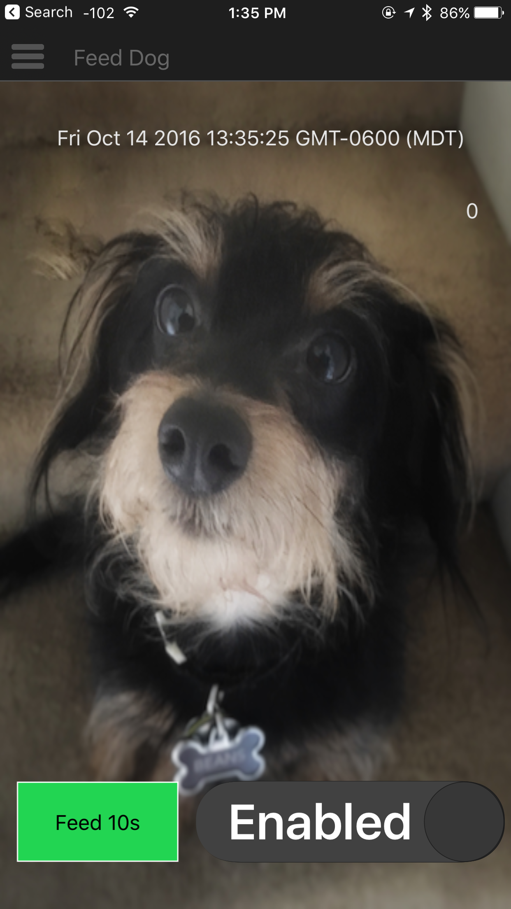

# Pi Feeder

### Description

Use a Raspberry Pi to control a Powerswitch Tail through a web interface, app, or schedule it via cron. There are many possible applications, but I use it to control a dog food dispenser. The dog gets fed automatically every morning. And if we are out of town, I can control it with an app.

### Hardware

* Raspberry Pi
* Powerswitch Tail (https://www.adafruit.com/products/268)
* Wires to connect Pi to the Tail

Here are the instructions I used to wire up the Pi: https://thepihut.com/blogs/raspberry-pi-tutorials/27968772-turning-on-an-led-with-your-raspberry-pis-gpio-pins

### Software

I used NetIO UI-Designer (http://netio.davideickhoff.de/) to create a basic app. I added controls for all the endpoints listed below and looks like this:



### Remote Access

I configured my router with port forwarding to send all port 8080 requests to port 3000 (the express server on the Pi). This allows me to control the feeder when I am not at home.

### Endpoints

| Endpoint             | Description                                     |
|:-------------------- |:----------------------------------------------- |
| /feed/status         | Current power status (0 = OFF, 1 = ON)          |
| /feed/enabled        | System enabled (0 = OFF, 1 = ON)                |
| /feed/enabled/on     | Enable the system                               |
| /feed/enabled/off    | Disable the system                              |
| /feed/timestamp      | Current system time                             |
| /feed/timer/:seconds | Turn power on for the given number of seconds   |

### crontab

I use crontab on the Pi to feed the dog every morning at 7:00am for 60 seconds:
```
0 7 * * * /usr/bin/curl http://localhost:3000/feed/timer/60 > /dev/null 2>&1
```

### Start on Boot

The application is set to run every time the Pi boots via the following line in /etc/rc.local (be sure to place it before the `exit 0` at the end of the script):
```
/home/pi/feeder/app.js &
```
